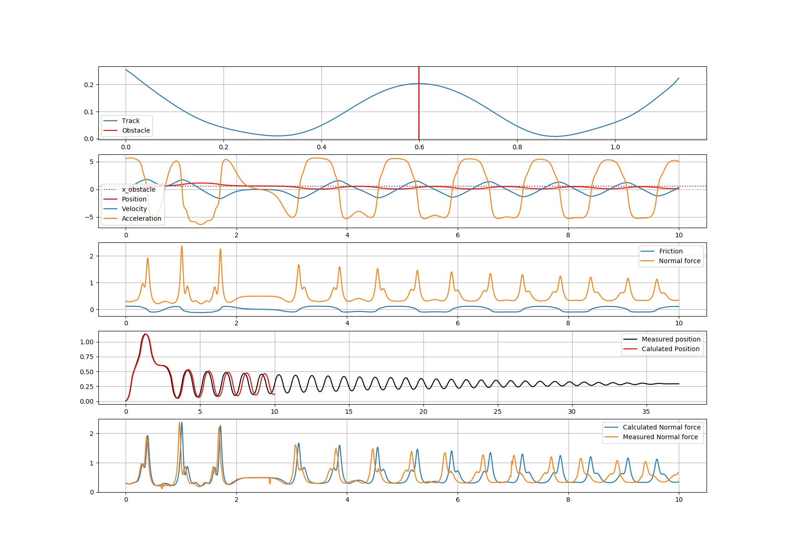
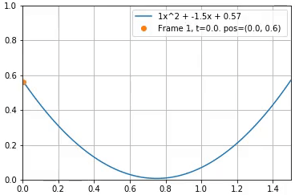
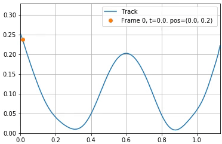

# Simulation of a rolling ball

## Running

1. Install python 3.6 or later (needs `f-strings` and `type-hinting`)
2. Set up a virtualenv: `virtualenv .venv` and `source .venv/Scripts/activate`
3. Install dependencies `pip install -r requirements.txt`
4. Run what you want (see below).

There are multiple files to run.  
You can run a jupyter notebook for some graphs and lots of sample code: `jupyter notebook` then open `Test data.ipynb`.  
Or run one of the three main files with `python`: `find_best_braking_factor.py`, `plot_numerical_model.py`, `obstacle_height_tester.py`.

A rendered version of [Test data.ipynb](Test%20data.ipynb) can be found in 
[Test data.html](Test%20data.html), so you don't need to run jupyter to see the results.

## Explanation

The braking factor is a coefficient used in acceleration to simulate drag and other sources of energy loss.  
The ball is rolling, not sliding.  
The track is represented with a parabola.  
The goal was to elevate the center of the parabola to a certain height, where the ball could pass exactly twice.

## Graphs and stuff

Calculated values and a simulation:

A gif of a rolling ball, with no obstacle:  

A gif with an obstacle:  

